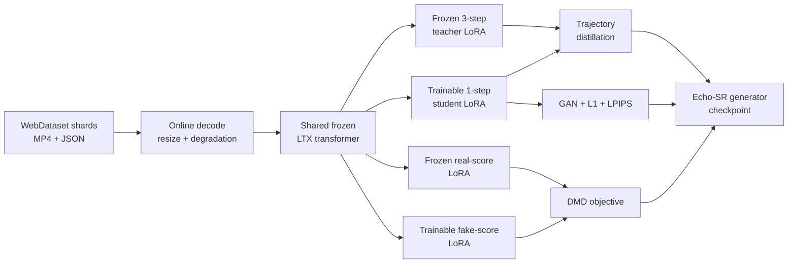

<p align="center">
  
</p>

<div align="center">

<h1>Echo-SR</h1>

<p><strong>One-step DMD video super-resolution for LTX-2 19B and LTX-2.3 22B</strong></p>

<p>
  <a href="README_zh.md"><b>中文</b></a> ·
  <a href="https://huggingface.co/xin1u/Echo-SR"><b>Models</b></a> ·
  <a href="#quick-start"><b>Quick Start</b></a> ·
  <a href="#training"><b>Training</b></a> ·
  <a href="#inference"><b>Inference</b></a>
</p>

<p>
  <a href="https://github.com/xin1u/Echo-SR/actions/workflows/static-checks.yml"></a>
  
  
  
  
  <a href="https://huggingface.co/xin1u/Echo-SR"></a>
</p>

</div>

Echo-SR is a research release for **one-step stage-2 video super-resolution**
on the LTX model family. The public code provides a shared online training path
for two model sizes, with frozen three-step teachers, DMD distribution matching,
GAN supervision, and pixel-level reconstruction losses.

> [!IMPORTANT]
> This repository is DMD-only and video-only. Both public configs require
> `dmd.enabled: true`; audio parameters are not trained and inference does not
> emit an audio track.

## Highlights

- ⚡ **One-step generator**: distills a frozen three-step teacher into a single stage-2 denoising step.
- 🧠 **DMD + GAN training**: combines distribution matching, adversarial supervision, L1, and LPIPS losses.
- 📦 **One WebDataset path**: 19B and 22B decode the same tar-shard format online with no offline pair dataset.
- 🧩 **Four LoRA branches**: teacher, student, real-score, and fake-score adapters share one frozen transformer.
- 🖥️ **FSDP launchers**: reproducible single-node and multi-node distributed entrypoints are included.

## Released Recipes

| Recipe | Base model | Training data | Student | Launcher |
| --- | --- | --- | --- | --- |
| **LTX-2 19B DMD** | LTX-2 19B dev | WebDataset video shards | One-step LoRA | `scripts/train_dmd_19b.sh` |
| **LTX-2.3 22B DMD** | LTX-2.3 22B dev | WebDataset video shards | One-step LoRA | `scripts/train_dmd_22b.sh` |

Both recipes use the same trainer and data contract. Model-family checkpoints,
official distilled LoRAs, and spatial upsamplers remain separate and must not be
mixed.

## Training Overview



The default public recipes train at `1024×1536`, `121` frames, and `24 fps`.
The shared trainer is
`packages/ltx-sr-trainer/scripts/train_stage2_sr_dmd_webdataset.py`.

## Repository Layout

```text
configs/
├── accelerate/fsdp_8gpu.yaml          Single-node FSDP configuration
├── echo_sr_ltx2_19b_dmd.yaml          19B WebDataset DMD recipe
└── echo_sr_ltx23_22b_dmd.yaml         22B WebDataset DMD recipe
packages/
├── ltx-core/                           Compatible LTX core snapshot
├── ltx-pipelines/                      Compatible LTX pipelines snapshot
├── ltx-trainer/                        Shared LTX training utilities
└── ltx-sr-trainer/                     Echo-SR dataset, DMD, and inference code
scripts/
├── train_dmd_19b.sh                    19B distributed launcher
├── train_dmd_22b.sh                    22B distributed launcher
└── infer.sh                             One-video inference launcher
tools/build_train_index.py              WebDataset shard index builder
```

Datasets, checkpoints, logs, and generated media are excluded from Git.

## Quick Start

### 1. Install

Requirements:

- Linux with NVIDIA GPUs
- Python 3.11 or 3.12
- PyTorch 2.7 or newer with a matching CUDA runtime
- `ffmpeg` and `ffprobe` on `PATH`
- Eight H200-class GPUs are recommended for the public FSDP configuration

Using `uv`:

```bash
git clone https://github.com/xin1u/Echo-SR.git
cd Echo-SR
uv sync --all-packages --all-extras
source .venv/bin/activate
```

Or install into an existing CUDA environment:

```bash
python -m pip install -e packages/ltx-core \
  -e packages/ltx-pipelines \
  -e packages/ltx-trainer \
  -e 'packages/ltx-sr-trainer[tracking]'
```

### 2. Download Checkpoints

Echo-SR generator weights are released on
[Hugging Face](https://huggingface.co/xin1u/Echo-SR):

```bash
hf download xin1u/Echo-SR --local-dir checkpoints/echo-sr
```

| Model family | Released generator |
| --- | --- |
| LTX-2 19B | `echo-sr-ltx2-19b-dmd-step18300.safetensors` |
| LTX-2.3 22B | `echo-sr-ltx2.3-22b-dmd-step04600.safetensors` |

Arrange base assets as follows:

```text
checkpoints/
├── gemma-3-12b/
├── lpips_vgg.pth
├── ltx-2-19b-dev.safetensors
├── ltx-2-19b-distilled-lora-384.safetensors
├── ltx-2-spatial-upscaler-x2-1.0.safetensors
├── ltx-2.3-22b-dev.safetensors
├── ltx-2.3-22b-distilled-lora-384.safetensors
└── ltx-2.3-spatial-upscaler-x2-1.1.safetensors
```

LTX-2.3 base assets are published by
[Lightricks](https://huggingface.co/Lightricks/LTX-2.3). Record the code commit,
model revision, filename, and checksum for every experiment.

### 3. Prepare WebDataset Shards

Each sample in a tar shard contains a matching `.mp4` and `.json`. Metadata must
include `height`, `width`, and at least one configured English caption path. See
`examples/sample_metadata.example.json`.

```bash
python tools/build_train_index.py \
  'data/shards/*.tar' \
  --output data/train_index.json
```

The same `data/train_index.json` format is consumed by both public recipes.

### 4. Validate the Setup

These commands validate configuration without loading checkpoints or CUDA:

```bash
python packages/ltx-sr-trainer/scripts/train_stage2_sr_dmd_webdataset.py \
  configs/echo_sr_ltx2_19b_dmd.yaml --validate-config

python packages/ltx-sr-trainer/scripts/train_stage2_sr_dmd_webdataset.py \
  configs/echo_sr_ltx23_22b_dmd.yaml --validate-config
```

Successful output explicitly reports `Config OK (DMD enabled)`.

## Training

### LTX-2 19B DMD

```bash
CUDA_VISIBLE_DEVICES=0,1,2,3,4,5,6,7 \
MASTER_PORT=29531 \
bash scripts/train_dmd_19b.sh
```

### LTX-2.3 22B DMD

```bash
CUDA_VISIBLE_DEVICES=0,1,2,3,4,5,6,7 \
MASTER_PORT=29532 \
bash scripts/train_dmd_22b.sh
```

Override configuration without editing launchers:

```bash
CONFIG=configs/echo_sr_ltx23_22b_dmd.yaml \
ECHO_SR_VENV=/path/to/venv \
NPROC_PER_NODE=8 \
bash scripts/train_dmd_22b.sh
```

For multi-node training, use the same `MASTER_ADDR`, `MASTER_PORT`, `NNODES`,
and `NPROC_PER_NODE` on every node and assign a distinct `NODE_RANK`.

SwanLab is optional. Enable it in YAML, install the `tracking` extra, and pass
the credential only at runtime:

```bash
export SWANLAB_API_KEY='...'
```

Outputs include the resolved `run_config.yaml`, scalar logs, validation
comparisons, and generator checkpoints under `<output_dir>/checkpoints/`.

## Inference

Use matching model-family assets to run either DMD generator:

```bash
bash scripts/infer.sh \
  --input-video input_lq.mp4 \
  --prompt 'A detailed cinematic scene.' \
  --output-dir outputs/inference \
  --checkpoint-path checkpoints/ltx-2.3-22b-dev.safetensors \
  --student-lora-path checkpoints/echo-sr/echo-sr-ltx2.3-22b-dmd-step04600.safetensors \
  --spatial-upsampler-path checkpoints/ltx-2.3-spatial-upscaler-x2-1.1.safetensors \
  --gemma-root checkpoints/gemma-3-12b \
  --target-height 1024 \
  --target-width 1536 \
  --num-frames 121 \
  --fps 24
```

Frame count must satisfy `8*k+1`; target height and width must be divisible by
64.

## Related Projects

- [JoyAI-Echo](https://github.com/jd-opensource/JoyAI-Echo)
- [LTX-2.3](https://huggingface.co/Lightricks/LTX-2.3)

## License and Attribution

This repository contains a modified compatibility snapshot of LTX code. See
[`NOTICE.md`](NOTICE.md) for provenance and modifications. The repository is
distributed under the included LTX-2 Community License Agreement. Model assets
may carry additional terms from their release pages.
