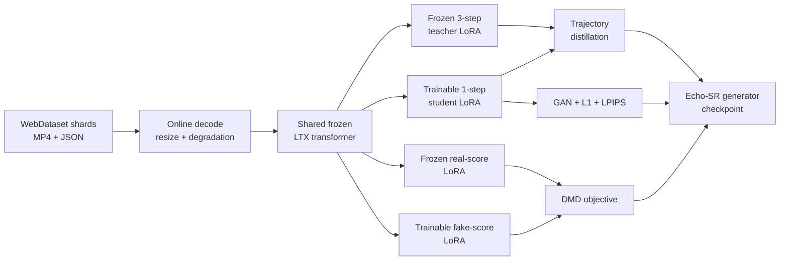

<p align="center">
  
</p>

<div align="center">

<h1>Echo-SR</h1>

<p><strong>Video and audio-video super-resolution for LTX-2 19B and LTX-2.3 22B</strong></p>

<p>
  <a href="README_zh.md"><b>中文</b></a> ·
  <a href="https://huggingface.co/xin1u/Echo-SR"><b>Models</b></a> ·
  <a href="#quick-start"><b>Quick Start</b></a> ·
  <a href="#training"><b>Training</b></a> ·
  <a href="#audio-video-long-video-sr"><b>Audio-Video SR</b></a> ·
  <a href="#inference"><b>Inference</b></a>
</p>

<p>
  <a href="https://github.com/xin1u/Echo-SR/actions/workflows/static-checks.yml"></a>
  
  
  
  
  <a href="https://huggingface.co/xin1u/Echo-SR"></a>
</p>

</div>

Echo-SR is a research release for **stage-2 super-resolution** on the LTX model
family. It covers two product lines that share a repository but not a code path:

- **Short-video, video-only DMD** — one-step generators for LTX-2 19B and
  LTX-2.3 22B, distilled from frozen three-step teachers with DMD distribution
  matching, GAN supervision, and pixel losses.
- **Long-video, audio-video restoration** — 736p → 1K / 2K joint audio-video
  enhancement on LTX-2.3 22B, with a multi-step teacher and a 1-step student,
  and sliding-window inference over arbitrarily long clips.

> [!IMPORTANT]
> The two product lines vendor **different LTX snapshots** that export the same
> Python module names. `packages/ltx-core` + `packages/ltx-trainer` serve the
> short-video DMD recipes; `packages/ltx-core-1.1` + `packages/ltx-trainer-1.1`
> serve the audio-video recipes. Never put both on one `PYTHONPATH` — always
> launch through the provided `scripts/*.sh`.

## Highlights

- ⚡ **One-step generator**: distills a frozen three-step teacher into a single stage-2 denoising step.
- 🧠 **DMD + GAN training**: combines distribution matching, adversarial supervision, L1, and LPIPS losses.
- 🔊 **Joint audio-video restoration**: LQ video *and* audio latents condition one transformer; the output carries a matching audio track.
- 🎞️ **Long-video inference**: sliding 121-frame windows sharded across GPUs, with drop-first-frame i2v chaining so seams do not drift.
- 📦 **One WebDataset path**: 19B and 22B decode the same tar-shard format online with no offline pair dataset.
- 🧩 **Four LoRA branches**: teacher, student, real-score, and fake-score adapters share one frozen transformer.
- 🖥️ **FSDP launchers**: reproducible single-node and multi-node distributed entrypoints are included.

## Released Recipes

| Recipe | Base model | Modality | Steps | Launcher |
| --- | --- | --- | --- | --- |
| **LTX-2 19B DMD** | LTX-2 19B dev | video | 1 | `scripts/train_dmd_19b.sh` |
| **LTX-2.3 22B DMD** | LTX-2.3 22B dev | video | 1 | `scripts/train_dmd_22b.sh` |
| **AV-SR 736p→1K** | LTX-2.3 22B dev | audio + video | multi | `scripts/train_av_sr_1k.sh` |
| **AV-SR 736p→2K** | LTX-2.3 22B dev | audio + video | multi | `scripts/train_av_sr_2k.sh` |
| **AV-SR 1K distill** | LTX-2.3 22B dev | audio + video | 1 | `scripts/train_av_distill_1k.sh` |

The two DMD recipes share one trainer and data contract. The three AV recipes
share a different trainer and the 1.1 vendored snapshot. Model-family
checkpoints, official distilled LoRAs, and spatial upsamplers remain separate
and must not be mixed.

## Training Overview



The default public recipes train at `1024×1536`, `121` frames, and `24 fps`.
The shared trainer is
`packages/ltx-sr-trainer/scripts/train_stage2_sr_dmd_webdataset.py`.

## Repository Layout

```text
configs/
├── accelerate/fsdp_8gpu.yaml          Single-node FSDP configuration (DMD)
├── accelerate/fsdp_av.yaml            Single-node FSDP configuration (audio-video)
├── echo_sr_ltx2_19b_dmd.yaml          19B WebDataset DMD recipe
├── echo_sr_ltx23_22b_dmd.yaml         22B WebDataset DMD recipe
├── av_sr_1k_multistep.yaml            736p→1K audio-video, multi-step teacher
├── av_sr_2k_multistep.yaml            736p→2K audio-video, multi-step
├── av_sr_1k_distill.yaml              1-step distillation, audio + video
└── av_sr_1k_distill_video.yaml        1-step distillation, video-focused final phase (released weights)
docs/av_sr_training.md                 Audio-video recipes: data contract and hyperparameters
packages/
├── ltx-core/                           LTX core snapshot — DMD path
├── ltx-pipelines/                      LTX pipelines snapshot — DMD path
├── ltx-trainer/                        LTX training utilities — DMD path
├── ltx-sr-trainer/                     Echo-SR DMD dataset, training, inference
├── ltx-core-1.1/                       LTX core snapshot — audio-video path
├── ltx-trainer-1.1/                    LTX training utilities — audio-video path
├── ltx-av-sr-trainer/                  Audio-video multi-step trainer + long-video inference
└── echo-av-distill/                    Audio-video 1-step distillation
scripts/
├── train_dmd_19b.sh                    19B distributed launcher
├── train_dmd_22b.sh                    22B distributed launcher
├── infer.sh                            One-video DMD inference launcher
├── train_av_sr_1k.sh                   736p→1K audio-video launcher
├── train_av_sr_2k.sh                   736p→2K audio-video launcher
├── train_av_distill_1k.sh              1-step distillation launcher
├── infer_av_sr_long.sh                 Multi-step long-video inference
└── infer_av_distill_long.sh            1-step long-video inference
tools/build_train_index.py              WebDataset shard index builder
```

Datasets, checkpoints, logs, and generated media are excluded from Git.

## Quick Start

### 1. Install

Requirements:

- Linux with NVIDIA GPUs
- Python 3.11 or 3.12
- PyTorch 2.7 or newer with a matching CUDA runtime
- `ffmpeg` and `ffprobe` on `PATH`
- Eight H200-class GPUs are recommended for the public FSDP configuration

Using `uv`:

```bash
git clone https://github.com/xin1u/Echo-SR.git
cd Echo-SR
uv sync --all-packages --all-extras
source .venv/bin/activate
```

Or install into an existing CUDA environment:

```bash
python -m pip install -e packages/ltx-core \
  -e packages/ltx-pipelines \
  -e packages/ltx-trainer \
  -e 'packages/ltx-sr-trainer[tracking]'
```

> The audio-video packages need a **separate** environment, because
> `packages/ltx-core-1.1` and `packages/ltx-core` both provide the `ltx_core`
> module:
>
> ```bash
> python -m pip install -e 'packages/ltx-av-sr-trainer[tracking,perceptual]' \
>   -e 'packages/echo-av-distill[tracking,perceptual]'
> ```
>
> The 1.1 core and trainer are not pip-installed at all — the launchers put
> `packages/ltx-core-1.1/src` and `packages/ltx-trainer-1.1/src` on
> `PYTHONPATH` ahead of everything else.

### 2. Download Checkpoints

Echo-SR generator weights are released on
[Hugging Face](https://huggingface.co/xin1u/Echo-SR):

```bash
hf download xin1u/Echo-SR --local-dir checkpoints/echo-sr
```

| Model family | Released generator |
| --- | --- |
| LTX-2 19B | `echo-sr-ltx2-19b-dmd-step18300.safetensors` |
| LTX-2.3 22B | `echo-sr-ltx2.3-22b-dmd-step04600.safetensors` |
| LTX-2.3 22B audio-video, multi-step teacher | `av-sr-1k-multistep-step09900.safetensors` |
| LTX-2.3 22B audio-video, 1-step student | `av-sr-1k-distill-video-step005100.safetensors` |

The last two form a pair: the 1-step student was distilled from the multi-step
teacher above it, and **both restore audio and video jointly**. The `-video` in
the student's filename refers to the losses of its final distillation phase,
not to its capability — see
[The 1-step student is audio-video capable](#the-1-step-student-is-audio-video-capable). Two auxiliary assets are published alongside them and are
required by the audio-video configs — `tinydecoder/taeltx2_3_wide.pth` (fast
latent preview decoder used during validation) and
`prompt/sr_prompt_embeddings.pt` (precomputed prompt embeddings, so the 1-step
path never loads a text encoder).

Arrange base assets as follows:

```text
checkpoints/
├── gemma-3-12b/
├── lpips_vgg.pth
├── ltx-2-19b-dev.safetensors
├── ltx-2-19b-distilled-lora-384.safetensors
├── ltx-2-spatial-upscaler-x2-1.0.safetensors
├── ltx-2.3-22b-dev.safetensors
├── ltx-2.3-22b-distilled-lora-384.safetensors
└── ltx-2.3-spatial-upscaler-x2-1.1.safetensors
```

LTX-2.3 base assets are published by
[Lightricks](https://huggingface.co/Lightricks/LTX-2.3). Record the code commit,
model revision, filename, and checksum for every experiment.

### 3. Prepare WebDataset Shards

Each sample in a tar shard contains a matching `.mp4` and `.json`. Metadata must
include `height`, `width`, and at least one configured English caption path. See
`examples/sample_metadata.example.json`.

```bash
python tools/build_train_index.py \
  'data/shards/*.tar' \
  --output data/train_index.json
```

The same `data/train_index.json` format is consumed by both public recipes.

### 4. Validate the Setup

These commands validate configuration without loading checkpoints or CUDA:

```bash
python packages/ltx-sr-trainer/scripts/train_stage2_sr_dmd_webdataset.py \
  configs/echo_sr_ltx2_19b_dmd.yaml --validate-config

python packages/ltx-sr-trainer/scripts/train_stage2_sr_dmd_webdataset.py \
  configs/echo_sr_ltx23_22b_dmd.yaml --validate-config
```

Successful output explicitly reports `Config OK (DMD enabled)`.

## Training

### LTX-2 19B DMD

```bash
CUDA_VISIBLE_DEVICES=0,1,2,3,4,5,6,7 \
MASTER_PORT=29531 \
bash scripts/train_dmd_19b.sh
```

### LTX-2.3 22B DMD

```bash
CUDA_VISIBLE_DEVICES=0,1,2,3,4,5,6,7 \
MASTER_PORT=29532 \
bash scripts/train_dmd_22b.sh
```

Override configuration without editing launchers:

```bash
CONFIG=configs/echo_sr_ltx23_22b_dmd.yaml \
ECHO_SR_VENV=/path/to/venv \
NPROC_PER_NODE=8 \
bash scripts/train_dmd_22b.sh
```

For multi-node training, use the same `MASTER_ADDR`, `MASTER_PORT`, `NNODES`,
and `NPROC_PER_NODE` on every node and assign a distinct `NODE_RANK`.

SwanLab is optional. Enable it in YAML, install the `tracking` extra, and pass
the credential only at runtime:

```bash
export SWANLAB_API_KEY='...'
```

Outputs include the resolved `run_config.yaml`, scalar logs, validation
comparisons, and generator checkpoints under `<output_dir>/checkpoints/`.

## Audio-Video Long-Video SR

The audio-video line restores 736p input to 1K or 2K while jointly enhancing the
audio track, then applies the result to clips of arbitrary length. It is a
different code path from the DMD recipes above — different trainer, different
vendored LTX snapshot, different launchers.

### How the conditioning works

The low-quality video and audio are VAE-encoded and injected as **latent
conditions**, concatenated onto the channel dimension of the noisy input and
absorbed by an expanded `patchify_proj` / `audio_patchify_proj`. Training
perturbs those conditions with noise sampled in
`[condition_noise_min, condition_noise_max]` so the model does not overfit to a
single degradation strength.

Video and audio share one 48-layer transformer. Cross-attention between the two
modalities is present in every layer, but **gradients are blocked between them
in layers 0–23** (`cross_attn_grad_isolation_layer: 24`); layers 24–47 let
gradients flow freely. Early layers therefore learn modality-specific features
without one branch destabilising the other, while late layers learn genuinely
joint representations.

All adapters are rank-384 / alpha-384 LoRA over ~40 module patterns, including
the audio-video cross-attention gate adaLN modules.

The 2K recipe adds `CondSRPatchifyProj`, a learned spatial projection that maps
the 40×23 LQ latent grid onto the 80×46 HQ grid. That module exists only in the
1.1 vendored core, which is the concrete reason the 1.1 snapshot ships
alongside the 1.0 one.

### Sliding-window long-video inference

Long clips are cut on shot boundaries. Each shot is 241 frames and is covered by
two 121-frame windows, `[shot_start, shot_start+121]` and
`[shot_start+120, shot_start+241]`, so windows overlap by one frame inside a shot
and not at all across shots. Windows are distributed across ranks, gathered on
rank 0, and crossfaded where they meet.

### Cross-window continuity: drop-first-frame i2v

The transformer has no memory between windows, so a naive sliding window drifts
in colour and identity at every seam. The 1-step path
(`packages/ltx-av-sr-trainer/scripts/infer_distill_v3_long.py`) solves this by
turning every window after the first into an **image-to-video generation whose
conditioning frame is then discarded**:

1. Before denoising, the previous window's **last** frame latent is written into
   the first `H×W` token slots of the new window's latent *and* `clean_latent`,
   and `denoise_mask` is zeroed for exactly those tokens. The window is now an
   i2v problem: frame 0 is given, the rest must be generated to continue it.
2. After every Euler step the model's prediction for those tokens is overwritten
   with the conditioning latent again, so a 1-step or few-step solver cannot let
   the anchor drift.
3. Once denoising finishes, the window's own last-frame latent is saved for the
   next window, and `video_tools.clear_conditioning()` **drops** the
   conditioning tokens before unpatchify and decode.

Step 3 is the reason this is "drop-first-frame" rather than plain i2v: the
conditioning frame is a duplicate of a frame the previous window already
rendered, so emitting it would stutter. Each window therefore contributes
`121 − 1 = 120` new frames and the concatenation is continuous. The first window
of each shot has no predecessor and runs in plain t2av mode; shots are
deliberately not chained to each other so a hard cut is not smoothed over.

The training-time counterpart is `first_frame_conditioning_p`: with that
probability a sample's first-frame tokens are replaced by clean HQ latents and
excluded from the loss, so the model sees the same i2v-with-a-given-first-frame
formulation it will meet at inference. It is `0.5` in `av_sr_1k_multistep.yaml`
and both distillation configs, and `0.0` in `av_sr_2k_multistep.yaml`.

The multi-step inference script (`infer_sr_long.py`) does **not** chain windows
this way — it denoises each window independently and relies on the crossfade
alone. Drop-first-frame chaining is what makes the 1-step model usable on long
input despite having no iterative refinement to hide seams.

### Training

```bash
# 736p → 1K, multi-step teacher
CUDA_VISIBLE_DEVICES=0,1,2,3,4,5,6,7 bash scripts/train_av_sr_1k.sh

# 736p → 2K, multi-step
CUDA_VISIBLE_DEVICES=0,1,2,3,4,5,6,7 bash scripts/train_av_sr_2k.sh

# 1-step distillation from the teacher above
CUDA_VISIBLE_DEVICES=0,1,2,3,4,5,6,7 bash scripts/train_av_distill_1k.sh

# final video-focused phase — this is the one that produced the released 1-step weights
CONFIG=configs/av_sr_1k_distill_video.yaml bash scripts/train_av_distill_1k.sh
```

The same `NNODES` / `NODE_RANK` / `MASTER_ADDR` / `MASTER_PORT` /
`NPROC_PER_NODE` conventions apply. Add `DRY_RUN=1` to print the resolved
`PYTHONPATH` and entry point without launching. See
[`docs/av_sr_training.md`](docs/av_sr_training.md) for the data contract and
per-recipe hyperparameters.

### The 1-step model is not a DMD student

`distillation.enable_dmd` selects the objective. Both released 1-step configs
set it to **`false`**, which means no distribution-matching loss is computed and
the critic branch is never updated. The student instead regresses onto the
teacher's trajectory under LPIPS, Haar wavelet, temporal-consistency, and pixel
losses. Only the short-video `ltx-sr-trainer` recipes are DMD.

Setting `enable_dmd: true` re-enables the DMD2 path in
`packages/echo-av-distill/src/echo_sr/training/distiller.py`; no weights are
released for that configuration.

### The 1-step student is audio-video capable

The released 1-step checkpoint was produced with
`configs/av_sr_1k_distill_video.yaml`, whose losses are video-focused
(`with_audio: false` — LPIPS, Haar wavelet, temporal; no audio STFT term). That
is a statement about the **final training phase**, not about the model:

- The checkpoint descends from a joint **audio-video** distillation run. Its
  audio branch — `audio_patchify_proj`, audio attention/FF LoRA in all 48
  blocks, `audio_proj_out`, the audio adaLN stacks, and the A↔V cross-attention
  gates — was trained there and carried through every later phase; the video
  branch was then further sharpened under the video-focused losses.
- Checkpoint saving (`_save_checkpoint` in
  `packages/echo-av-distill/src/echo_sr/training/distiller.py`) always writes
  the full 3,330-tensor adapter set, including all 2,136 audio-branch tensors,
  so the released file is structurally identical to the multi-step teacher.
- The 1-step inference script (`infer_distill_v3_long.py`) unconditionally
  loads the audio VAE and vocoder, denoises audio latents alongside video in
  the same single step, and muxes the enhanced track into the output whenever
  the input has audio.

In short: use it as a **1-step audio-video SR model**. Inputs without an audio
track simply produce silent video.

### Inference

```bash
# multi-step, audio + video output
NPROC_PER_NODE=8 bash scripts/infer_av_sr_long.sh \
  --input input_736p.mp4 \
  --checkpoint checkpoints/echo-sr/av-sr-1k-multistep-step09900.safetensors \
  --output-dir outputs/av_sr_long

# 1-step, audio + video output
NPROC_PER_NODE=8 bash scripts/infer_av_distill_long.sh \
  --input input_736p.mp4 \
  --checkpoint checkpoints/echo-sr/av-sr-1k-distill-video-step005100.safetensors \
  --output-dir outputs/av_distill_long
```

Pass `--prompt-file` a JSON of per-shot `Summary` strings to steer each shot, or
`--prompt` for a single fallback used everywhere. The 1-step path reads prompt
embeddings from `AV_SR_PROMPT_CACHE` instead of loading Gemma.

## Inference

Use matching model-family assets to run either DMD generator:

```bash
bash scripts/infer.sh \
  --input-video input_lq.mp4 \
  --prompt 'A detailed cinematic scene.' \
  --output-dir outputs/inference \
  --checkpoint-path checkpoints/ltx-2.3-22b-dev.safetensors \
  --student-lora-path checkpoints/echo-sr/echo-sr-ltx2.3-22b-dmd-step04600.safetensors \
  --spatial-upsampler-path checkpoints/ltx-2.3-spatial-upscaler-x2-1.1.safetensors \
  --gemma-root checkpoints/gemma-3-12b \
  --target-height 1024 \
  --target-width 1536 \
  --num-frames 121 \
  --fps 24
```

Frame count must satisfy `8*k+1`; target height and width must be divisible by
64.

## Related Projects

- [JoyAI-Echo](https://github.com/jd-opensource/JoyAI-Echo)
- [LTX-2.3](https://huggingface.co/Lightricks/LTX-2.3)

## License and Attribution

This repository contains a modified compatibility snapshot of LTX code. See
[`NOTICE.md`](NOTICE.md) for provenance and modifications. The repository is
distributed under the included LTX-2 Community License Agreement. Model assets
may carry additional terms from their release pages.
