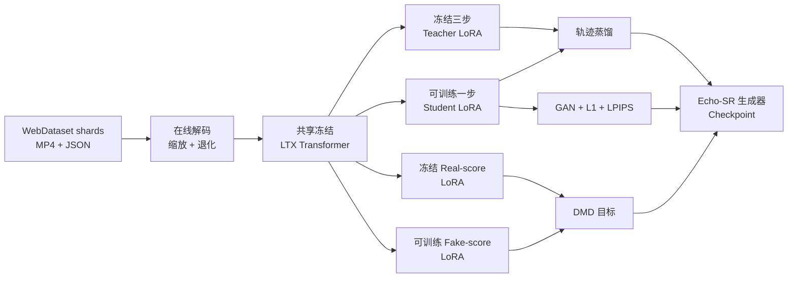

<p align="center">
  
</p>

<div align="center">

<h1>Echo-SR</h1>

<p><strong>面向 LTX-2 19B 与 LTX-2.3 22B 的一步 DMD 视频超分</strong></p>

<p>
  <a href="README.md"><b>English</b></a> ·
  <a href="https://huggingface.co/xin1u/Echo-SR"><b>模型权重</b></a> ·
  <a href="#快速开始"><b>快速开始</b></a> ·
  <a href="#训练"><b>训练</b></a> ·
  <a href="#推理"><b>推理</b></a>
</p>

<p>
  <a href="https://github.com/xin1u/Echo-SR/actions/workflows/static-checks.yml"></a>
  
  
  
  
  <a href="https://huggingface.co/xin1u/Echo-SR"></a>
</p>

</div>

Echo-SR 是面向 LTX 系列模型的**一步二阶段视频超分**研究代码。公开版本为
19B 和 22B 提供统一的在线训练链路，组合冻结三步教师、DMD 分布匹配、GAN 监督和
像素级重建损失。

> [!IMPORTANT]
> 本仓库只公开 DMD 视频方案。两份配置都必须设置 `dmd.enabled: true`；音频参数不参与
> 训练，当前推理入口也不会生成音轨。

## 核心特点

- ⚡ **一步生成器**：将冻结三步教师蒸馏为单次二阶段去噪。
- 🧠 **DMD + GAN 训练**：联合分布匹配、对抗监督、L1 与 LPIPS 损失。
- 📦 **统一 WebDataset**：19B 和 22B 在线读取同一种 tar shard，不依赖离线 pair 数据集。
- 🧩 **四路 LoRA**：teacher、student、real-score 和 fake-score 共享同一个冻结 Transformer。
- 🖥️ **FSDP 启动链路**：提供可复现的单机与多机分布式训练入口。

## 已发布方案

| 方案 | 基座 | 训练数据 | 学生模型 | 启动脚本 |
| --- | --- | --- | --- | --- |
| **LTX-2 19B DMD** | LTX-2 19B dev | WebDataset 视频 shard | 一步 LoRA | `scripts/train_dmd_19b.sh` |
| **LTX-2.3 22B DMD** | LTX-2.3 22B dev | WebDataset 视频 shard | 一步 LoRA | `scripts/train_dmd_22b.sh` |

两个方案使用相同的 trainer 和数据协议，但基座、官方蒸馏 LoRA 与空间上采样器必须按
模型家族分别配置，不能交叉混用。

## 训练流程



公开配置默认训练尺寸为 `1024×1536`，视频为 `121` 帧、`24 fps`。共享训练器位于
`packages/ltx-sr-trainer/scripts/train_stage2_sr_dmd_webdataset.py`。

## 目录结构

```text
configs/
├── accelerate/fsdp_8gpu.yaml          单节点 FSDP 配置
├── echo_sr_ltx2_19b_dmd.yaml          19B WebDataset DMD 配置
└── echo_sr_ltx23_22b_dmd.yaml         22B WebDataset DMD 配置
packages/
├── ltx-core/                           兼容的 LTX core 源码
├── ltx-pipelines/                      兼容的 LTX pipelines 源码
├── ltx-trainer/                        通用 LTX 训练工具
└── ltx-sr-trainer/                     Echo-SR 数据、DMD 与推理代码
scripts/
├── train_dmd_19b.sh                    19B 分布式启动入口
├── train_dmd_22b.sh                    22B 分布式启动入口
└── infer.sh                             单视频推理入口
tools/build_train_index.py              WebDataset shard 索引生成工具
```

数据集、权重、日志和生成媒体不会提交到 Git。

## 快速开始

### 1. 安装环境

环境要求：

- Linux 与 NVIDIA GPU
- Python 3.11 或 3.12
- PyTorch 2.7 或更高版本及匹配的 CUDA
- `PATH` 中可以调用 `ffmpeg` 和 `ffprobe`
- 公开 FSDP 配置建议使用单节点 8 张 H200 同等级 GPU

使用 `uv`：

```bash
git clone https://github.com/xin1u/Echo-SR.git
cd Echo-SR
uv sync --all-packages --all-extras
source .venv/bin/activate
```

安装到已有 CUDA 环境：

```bash
python -m pip install -e packages/ltx-core \
  -e packages/ltx-pipelines \
  -e packages/ltx-trainer \
  -e 'packages/ltx-sr-trainer[tracking]'
```

### 2. 下载权重

Echo-SR 生成器权重发布在
[Hugging Face](https://huggingface.co/xin1u/Echo-SR)：

```bash
hf download xin1u/Echo-SR --local-dir checkpoints/echo-sr
```

基座权重按下面的结构放置：

```text
checkpoints/
├── gemma-3-12b/
├── lpips_vgg.pth
├── ltx-2-19b-dev.safetensors
├── ltx-2-19b-distilled-lora-384.safetensors
├── ltx-2-spatial-upscaler-x2-1.0.safetensors
├── ltx-2.3-22b-dev.safetensors
├── ltx-2.3-22b-distilled-lora-384.safetensors
└── ltx-2.3-spatial-upscaler-x2-1.1.safetensors
```

LTX-2.3 官方资产由
[Lightricks](https://huggingface.co/Lightricks/LTX-2.3) 发布。每次实验都应记录代码
commit、模型 revision、文件名与校验值。

### 3. 准备 WebDataset

每个 tar shard 样本包含同名 `.mp4` 和 `.json`。Metadata 至少需要包含 `height`、
`width` 和配置指定的一项英文 caption，格式见
`examples/sample_metadata.example.json`。

```bash
python tools/build_train_index.py \
  'data/shards/*.tar' \
  --output data/train_index.json
```

两份公开配置都直接读取相同格式的 `data/train_index.json`。

### 4. 检查配置

下面的命令不会加载权重或初始化 CUDA：

```bash
python packages/ltx-sr-trainer/scripts/train_stage2_sr_dmd_webdataset.py \
  configs/echo_sr_ltx2_19b_dmd.yaml --validate-config

python packages/ltx-sr-trainer/scripts/train_stage2_sr_dmd_webdataset.py \
  configs/echo_sr_ltx23_22b_dmd.yaml --validate-config
```

成功时会明确输出 `Config OK (DMD enabled)`。

## 训练

### LTX-2 19B DMD

```bash
CUDA_VISIBLE_DEVICES=0,1,2,3,4,5,6,7 \
MASTER_PORT=29531 \
bash scripts/train_dmd_19b.sh
```

### LTX-2.3 22B DMD

```bash
CUDA_VISIBLE_DEVICES=0,1,2,3,4,5,6,7 \
MASTER_PORT=29532 \
bash scripts/train_dmd_22b.sh
```

无需修改启动脚本即可覆盖配置：

```bash
CONFIG=configs/echo_sr_ltx23_22b_dmd.yaml \
ECHO_SR_VENV=/path/to/venv \
NPROC_PER_NODE=8 \
bash scripts/train_dmd_22b.sh
```

多机训练时，各节点使用相同的 `MASTER_ADDR`、`MASTER_PORT`、`NNODES` 和
`NPROC_PER_NODE`，并为每个节点设置不同的 `NODE_RANK`。

SwanLab 为可选项。请在 YAML 中开启、安装 `tracking` extra，并只在运行时注入密钥：

```bash
export SWANLAB_API_KEY='...'
```

输出包括解析后的 `run_config.yaml`、标量日志、验证对比，以及
`<output_dir>/checkpoints/` 下的生成器权重。

## 推理

选择匹配的模型资产即可运行 19B 或 22B DMD 生成器：

```bash
bash scripts/infer.sh \
  --input-video input_lq.mp4 \
  --prompt 'A detailed cinematic scene.' \
  --output-dir outputs/inference \
  --checkpoint-path checkpoints/ltx-2.3-22b-dev.safetensors \
  --student-lora-path checkpoints/echo-sr/GENERATOR.safetensors \
  --spatial-upsampler-path checkpoints/ltx-2.3-spatial-upscaler-x2-1.1.safetensors \
  --gemma-root checkpoints/gemma-3-12b \
  --target-height 1024 \
  --target-width 1536 \
  --num-frames 121 \
  --fps 24
```

帧数必须满足 `8*k+1`，目标高宽必须能被 64 整除。

## 相关项目

- [JoyAI-Echo](https://github.com/jd-opensource/JoyAI-Echo)
- [LTX-2.3](https://huggingface.co/Lightricks/LTX-2.3)

## 许可证与来源

仓库包含修改后的 LTX 兼容源码快照，来源和修改内容见 [`NOTICE.md`](NOTICE.md)。整体按
仓库附带的 LTX-2 Community License Agreement 发布，模型资产还需遵守各自发布页面上的
附加条款。
