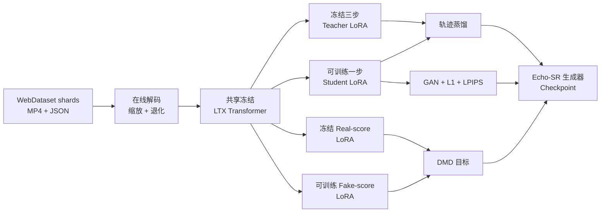

<p align="center">
  
</p>

<div align="center">

<h1>JoyAI-Echo-SR</h1>

<p><strong>面向 LTX-2 19B 与 LTX-2.3 22B 的视频 / 音视频超分</strong></p>

<p>
  <a href="README.md"><b>English</b></a> ·
  <a href="https://huggingface.co/xin1u/JoyAI-Echo-SR"><b>模型权重</b></a> ·
  <a href="#动态"><b>动态</b></a> ·
  <a href="#快速开始"><b>快速开始</b></a> ·
  <a href="#训练"><b>训练</b></a> ·
  <a href="#长视频音视频超分"><b>音视频超分</b></a> ·
  <a href="#推理"><b>推理</b></a>
</p>

<p>
  <a href="https://github.com/xin1u/JoyAI-Echo-SR/actions/workflows/static-checks.yml"></a>
  
  
  
  
  <a href="https://huggingface.co/xin1u/JoyAI-Echo-SR"></a>
</p>

</div>

JoyAI-Echo-SR 是 [JoyAI-Echo](https://github.com/jd-opensource/JoyAI-Echo) 的超分子项目，
面向 LTX 系列模型的**二阶段超分**研究代码，包含两条共用仓库但**不共用代码路径**
的产品线：

- **短视频、纯视频 DMD** —— LTX-2 19B 与 LTX-2.3 22B 的一步生成器，由冻结三步教师经
  DMD 分布匹配、GAN 监督与像素损失蒸馏得到。
- **长视频音视频修复** —— LTX-2.3 22B 上的 736p → 1K / 2K 音视频联合增强，含多步教师与
  一步学生，并支持任意长度片段的滑窗推理。

> [!IMPORTANT]
> 两条产品线 vendor 了**不同的 LTX 快照**，但它们导出同名 Python 模块。
> `packages/ltx-core` + `packages/ltx-trainer` 服务短视频 DMD；
> `packages/ltx-core-1.1` + `packages/ltx-trainer-1.1` 服务音视频。
> 切勿把两者放进同一个 `PYTHONPATH` —— 一律通过 `scripts/*.sh` 启动。

## 动态

- **`2026-08-07`** 🔍 发布 **736p→2K 音视频多步**权重 —— 基于 `CondSRPatchifyProj` 的精确 2 倍放大（2560×1472），音视频联合修复。
- **`2026-08-07`** 🎬 发布**长视频音视频超分** —— 736p→1K 多步教师 + 一步学生，滑窗 + drop 首帧 i2v 串联，支持任意长度片段。
- **`2026-08-04`** ⚡ 发布**短视频 DMD** —— LTX-2 19B / LTX-2.3 22B 的一步二阶段超分生成器，DMD + GAN + 像素损失训练。

## 路线图

- [x] 短视频一步 DMD 超分（LTX-2 19B / LTX-2.3 22B）
- [x] 长视频音视频超分，736p→1K 多步教师
- [x] 长视频音视频超分，736p→1K 一步学生
- [x] 长视频音视频超分，736p→2K 多步
- [ ] 长视频音视频超分，736p→2K **一步蒸馏** —— 训练中，权重尚未发布

## 核心特点

- ⚡ **一步生成器**：将冻结三步教师蒸馏为单次二阶段去噪。
- 🧠 **DMD + GAN 训练**：联合分布匹配、对抗监督、L1 与 LPIPS 损失。
- 🔊 **音视频联合修复**：LQ 视频*与*音频 latent 共同条件化同一个 Transformer，输出自带匹配音轨。
- 🎞️ **长视频推理**：121 帧滑窗按 rank 分卡，配合 drop 首帧 i2v 串联，窗口接缝不漂移。
- 📦 **统一 WebDataset**：19B 和 22B 在线读取同一种 tar shard，不依赖离线 pair 数据集。
- 🧩 **四路 LoRA**：teacher、student、real-score 和 fake-score 共享同一个冻结 Transformer。
- 🖥️ **FSDP 启动链路**：提供可复现的单机与多机分布式训练入口。

## 已发布方案

| 方案 | 基座 | 模态 | 步数 | 启动脚本 |
| --- | --- | --- | --- | --- |
| **LTX-2 19B DMD** | LTX-2 19B dev | 视频 | 1 | `scripts/train_dmd_19b.sh` |
| **LTX-2.3 22B DMD** | LTX-2.3 22B dev | 视频 | 1 | `scripts/train_dmd_22b.sh` |
| **AV-SR 736p→1K** | LTX-2.3 22B dev | 音频 + 视频 | 多步 | `scripts/train_av_sr_1k.sh` |
| **AV-SR 736p→2K** | LTX-2.3 22B dev | 音频 + 视频 | 多步 | `scripts/train_av_sr_2k.sh` |
| **AV-SR 1K 蒸馏** | LTX-2.3 22B dev | 音频 + 视频 | 1 | `scripts/train_av_distill_1k.sh` |

两个 DMD 方案共用一套 trainer 和数据协议；三个 AV 方案共用另一套 trainer 与 1.1 快照。
基座、官方蒸馏 LoRA 与空间上采样器必须按模型家族分别配置，不能交叉混用。

## 训练流程



公开配置默认训练尺寸为 `1024×1536`，视频为 `121` 帧、`24 fps`。共享训练器位于
`packages/ltx-sr-trainer/scripts/train_stage2_sr_dmd_webdataset.py`。

## 目录结构

```text
configs/
├── accelerate/fsdp_8gpu.yaml          单节点 FSDP 配置（DMD）
├── accelerate/fsdp_av.yaml            单节点 FSDP 配置（音视频）
├── echo_sr_ltx2_19b_dmd.yaml          19B WebDataset DMD 配置
├── echo_sr_ltx23_22b_dmd.yaml         22B WebDataset DMD 配置
├── av_sr_1k_multistep.yaml            736p→1K 音视频，多步教师
├── av_sr_2k_multistep.yaml            736p→2K 音视频，多步
├── av_sr_1k_distill.yaml              一步蒸馏，音频 + 视频
└── av_sr_1k_distill_video.yaml        一步蒸馏，末段视频侧重损失（对应已发布权重）
docs/av_sr_training.md                 音视频方案：数据契约与超参
packages/
├── ltx-core/                           LTX core 快照 —— DMD 路径
├── ltx-pipelines/                      LTX pipelines 快照 —— DMD 路径
├── ltx-trainer/                        LTX 训练工具 —— DMD 路径
├── ltx-sr-trainer/                     Echo-SR DMD 数据、训练与推理
├── ltx-core-1.1/                       LTX core 快照 —— 音视频路径
├── ltx-trainer-1.1/                    LTX 训练工具 —— 音视频路径
├── ltx-av-sr-trainer/                  音视频多步训练 + 长视频推理
└── echo-av-distill/                    音视频一步蒸馏
scripts/
├── train_dmd_19b.sh                    19B 分布式启动入口
├── train_dmd_22b.sh                    22B 分布式启动入口
├── infer.sh                            单视频 DMD 推理入口
├── train_av_sr_1k.sh                   736p→1K 音视频启动入口
├── train_av_sr_2k.sh                   736p→2K 音视频启动入口
├── train_av_distill_1k.sh              一步蒸馏启动入口
├── infer_av_sr_long.sh                 多步长视频推理
└── infer_av_distill_long.sh            一步长视频推理
tools/build_train_index.py              WebDataset shard 索引生成工具
```

数据集、权重、日志和生成媒体不会提交到 Git。

## 快速开始

### 1. 安装环境

环境要求：

- Linux 与 NVIDIA GPU
- Python 3.11 或 3.12
- PyTorch 2.7 或更高版本及匹配的 CUDA
- `PATH` 中可以调用 `ffmpeg` 和 `ffprobe`
- 公开 FSDP 配置建议使用单节点 8 张 H200 同等级 GPU

使用 `uv`：

```bash
git clone https://github.com/xin1u/JoyAI-Echo-SR.git
cd JoyAI-Echo-SR
uv sync --all-packages --all-extras
source .venv/bin/activate
```

安装到已有 CUDA 环境：

```bash
python -m pip install -e packages/ltx-core \
  -e packages/ltx-pipelines \
  -e packages/ltx-trainer \
  -e 'packages/ltx-sr-trainer[tracking]'
```

> 音视频那两个包需要**独立的**环境，因为 `packages/ltx-core-1.1` 和
> `packages/ltx-core` 都提供 `ltx_core` 模块：
>
> ```bash
> python -m pip install -e 'packages/ltx-av-sr-trainer[tracking,perceptual]' \
>   -e 'packages/echo-av-distill[tracking,perceptual]'
> ```
>
> 1.1 的 core 与 trainer 完全不走 pip —— 启动脚本会把
> `packages/ltx-core-1.1/src` 和 `packages/ltx-trainer-1.1/src` 前置到
> `PYTHONPATH`。

### 2. 下载权重

Echo-SR 生成器权重发布在
[Hugging Face](https://huggingface.co/xin1u/JoyAI-Echo-SR)：

```bash
hf download xin1u/JoyAI-Echo-SR --local-dir checkpoints/echo-sr
```

| 模型家族 | 已发布生成器 |
| --- | --- |
| LTX-2 19B | `echo-sr-ltx2-19b-dmd-step18300.safetensors` |
| LTX-2.3 22B | `echo-sr-ltx2.3-22b-dmd-step04600.safetensors` |
| LTX-2.3 22B 音视频多步教师 | `av-sr-1k-multistep-step09900.safetensors` |
| LTX-2.3 22B 音视频一步学生 | `av-sr-1k-distill-video-step005100.safetensors` |
| LTX-2.3 22B 音视频 2K 多步 | `av-sr-2k-multistep-step08000.safetensors` |

1K 多步与一步是一对：一步学生正是由它上面那个多步教师蒸馏而来，**两者都做音视频联合修复**。
一步权重文件名里的 `-video` 指的是其最后一段蒸馏采用视频侧重损失，而不是它只能出视频
——见[一步学生支持音视频推理](#一步学生支持音视频推理)。2K 权重是独立的多步模型，
基于 `CondSRPatchifyProj` 做精确 2 倍放大（1280×736 → 2560×1472）。同时还发布了两个音视频配置
必须的辅助资产 —— `tinydecoder/taeltx2_3_wide.pth`（验证阶段用的快速 latent 预览
解码器）和 `prompt/sr_prompt_embeddings.pt`（预计算 prompt embedding，使一步路径完全
不加载文本编码器）。

基座权重按下面的结构放置：

```text
checkpoints/
├── gemma-3-12b/
├── lpips_vgg.pth
├── ltx-2-19b-dev.safetensors
├── ltx-2-19b-distilled-lora-384.safetensors
├── ltx-2-spatial-upscaler-x2-1.0.safetensors
├── ltx-2.3-22b-dev.safetensors
├── ltx-2.3-22b-distilled-lora-384.safetensors
└── ltx-2.3-spatial-upscaler-x2-1.1.safetensors
```

LTX-2.3 官方资产由
[Lightricks](https://huggingface.co/Lightricks/LTX-2.3) 发布。每次实验都应记录代码
commit、模型 revision、文件名与校验值。

### 3. 准备 WebDataset

每个 tar shard 样本包含同名 `.mp4` 和 `.json`。Metadata 至少需要包含 `height`、
`width` 和配置指定的一项英文 caption，格式见
`examples/sample_metadata.example.json`。

```bash
python tools/build_train_index.py \
  'data/shards/*.tar' \
  --output data/train_index.json
```

两份公开配置都直接读取相同格式的 `data/train_index.json`。

### 4. 检查配置

下面的命令不会加载权重或初始化 CUDA：

```bash
python packages/ltx-sr-trainer/scripts/train_stage2_sr_dmd_webdataset.py \
  configs/echo_sr_ltx2_19b_dmd.yaml --validate-config

python packages/ltx-sr-trainer/scripts/train_stage2_sr_dmd_webdataset.py \
  configs/echo_sr_ltx23_22b_dmd.yaml --validate-config
```

成功时会明确输出 `Config OK (DMD enabled)`。

## 训练

### LTX-2 19B DMD

```bash
CUDA_VISIBLE_DEVICES=0,1,2,3,4,5,6,7 \
MASTER_PORT=29531 \
bash scripts/train_dmd_19b.sh
```

### LTX-2.3 22B DMD

```bash
CUDA_VISIBLE_DEVICES=0,1,2,3,4,5,6,7 \
MASTER_PORT=29532 \
bash scripts/train_dmd_22b.sh
```

无需修改启动脚本即可覆盖配置：

```bash
CONFIG=configs/echo_sr_ltx23_22b_dmd.yaml \
ECHO_SR_VENV=/path/to/venv \
NPROC_PER_NODE=8 \
bash scripts/train_dmd_22b.sh
```

多机训练时，各节点使用相同的 `MASTER_ADDR`、`MASTER_PORT`、`NNODES` 和
`NPROC_PER_NODE`，并为每个节点设置不同的 `NODE_RANK`。

SwanLab 为可选项。请在 YAML 中开启、安装 `tracking` extra，并只在运行时注入密钥：

```bash
export SWANLAB_API_KEY='...'
```

输出包括解析后的 `run_config.yaml`、标量日志、验证对比，以及
`<output_dir>/checkpoints/` 下的生成器权重。

## 长视频音视频超分

音视频这条线把 736p 输入修复到 1K 或 2K，同时联合增强音轨，并可作用于任意长度的片段。
它与上面的 DMD 方案是**完全不同的代码路径** —— 不同的 trainer、不同的 vendor 快照、
不同的启动脚本。

### 条件注入方式

低质视频和音频经 VAE 编码后作为 **latent 条件**，在通道维上与带噪输入拼接，由扩展后的
`patchify_proj` / `audio_patchify_proj` 吸收。训练时会给这些条件加上从
`[condition_noise_min, condition_noise_max]` 采样的噪声，避免模型过拟合到单一退化强度。

视频和音频共享同一个 48 层 Transformer，每层都有跨模态注意力，但**第 0–23 层之间梯度被
切断**（`cross_attn_grad_isolation_layer: 24`），第 24–47 层梯度自由流动。这样浅层各自
学模态专属特征、互不干扰，深层才学真正的联合表征。

所有 adapter 都是 rank-384 / alpha-384 的 LoRA，覆盖约 40 类模块，含音视频跨注意力的
gate adaLN。

2K 方案额外引入 `CondSRPatchifyProj`：一个把 40×23 的 LQ latent 网格映射到 80×46 HQ 网格
的可学习空间投影。该模块**只存在于 1.1 快照**，这也是必须同时 vendor 1.1 的直接原因。

### 滑窗长视频推理

长片按镜头切分。每个镜头 241 帧，由两个 121 帧窗口覆盖：`[shot_start, shot_start+121]`
和 `[shot_start+120, shot_start+241]`，即镜头内窗口重叠 1 帧、跨镜头不重叠。窗口按 rank
分发，在 rank 0 汇总并在接缝处交叉淡化。

### 跨窗连续性：drop 首帧 i2v

Transformer 在窗口之间没有记忆，朴素滑窗会在每条接缝上出现色彩和身份漂移。一步路径
（`packages/ltx-av-sr-trainer/scripts/infer_distill_v3_long.py`）的做法是把第一个窗口之后
的每个窗口都变成一次**图生视频，然后把那个条件帧丢掉**：

1. 去噪前，把上一窗口的**最后**一帧 latent 写进本窗口 `latent` 和 `clean_latent` 的前
   `H×W` 个 token 槽位，并把这些 token 的 `denoise_mask` 置零。此刻问题变成 i2v：
   第 0 帧已给定，其余帧需要续写出来。
2. 每个 Euler 步之后，都用条件 latent 重新覆盖模型在这些 token 上的预测，防止一步或少步
   solver 让锚点漂走。
3. 去噪结束后，先保存本窗口自己的末帧 latent 供下一窗口使用，再用
   `video_tools.clear_conditioning()` 在 unpatchify 和解码之前把条件 token **丢掉**。

第 3 步正是"drop 首帧"而非普通 i2v 的原因：那个条件帧是上一窗口已经渲染过的帧的副本，
输出它会造成卡顿。于是每个窗口实际贡献 `121 − 1 = 120` 帧新内容，拼接后连续。每个镜头的
第一个窗口没有前驱，走普通 t2av；镜头之间**故意不串联**，以免把硬切平滑掉。

训练侧的对应物是 `first_frame_conditioning_p`：以该概率把样本的首帧 token 替换为干净的
HQ latent 并排除出损失，让模型在训练中就见到"给定首帧、续写后续"这一形式。
`av_sr_1k_multistep.yaml` 和两个蒸馏配置取 `0.5`，`av_sr_2k_multistep.yaml` 取 `0.0`。

多步推理脚本（`infer_sr_long.py`）**不做**这种串联 —— 它独立去噪每个窗口，只靠交叉淡化。
drop 首帧串联正是一步模型在没有迭代精修去遮掩接缝的情况下仍能处理长输入的关键。

### 训练

```bash
# 736p → 1K，多步教师
CUDA_VISIBLE_DEVICES=0,1,2,3,4,5,6,7 bash scripts/train_av_sr_1k.sh

# 736p → 2K，多步
CUDA_VISIBLE_DEVICES=0,1,2,3,4,5,6,7 bash scripts/train_av_sr_2k.sh

# 从上面的教师做一步蒸馏
CUDA_VISIBLE_DEVICES=0,1,2,3,4,5,6,7 bash scripts/train_av_distill_1k.sh

# 末段视频侧重损失 —— 已发布的一步权重出自这条
CONFIG=configs/av_sr_1k_distill_video.yaml bash scripts/train_av_distill_1k.sh
```

`NNODES` / `NODE_RANK` / `MASTER_ADDR` / `MASTER_PORT` / `NPROC_PER_NODE` 约定与 DMD 一致。
加 `DRY_RUN=1` 可以只打印解析后的 `PYTHONPATH` 和入口而不真正启动。数据契约和逐方案超参
见 [`docs/av_sr_training.md`](docs/av_sr_training.md)。

### 一步模型不是 DMD 学生

`distillation.enable_dmd` 决定目标函数，两个已发布的一步配置都把它设为 **`false`**：
不计算分布匹配损失，critic 分支也从不更新。学生实际是在 LPIPS、Haar 小波、时序一致性和
像素损失下回归教师轨迹。只有短视频的 `ltx-sr-trainer` 那套才是 DMD。

把 `enable_dmd` 设为 `true` 会重新启用
`packages/echo-av-distill/src/echo_sr/training/distiller.py` 里的 DMD2 路径，但该配置下
没有发布权重。

### 一步学生支持音视频推理

已发布的一步权重由 `configs/av_sr_1k_distill_video.yaml` 训出，其损失是视频侧重的
（`with_audio: false` —— LPIPS、Haar 小波、时序损失，无音频 STFT 项）。但这说的是
**最后一段训练**，不是模型能力：

- 该权重继承自一次**音视频联合**蒸馏：音频分支 —— `audio_patchify_proj`、全部 48 层的
  音频 attention / FF LoRA、`audio_proj_out`、音频 adaLN、A↔V 跨注意力 gate ——
  在那一阶段训练完成并一路带到发布权重里；之后的视频侧重阶段只是继续强化视频分支。
- 存 checkpoint 时（`packages/echo-av-distill/src/echo_sr/training/distiller.py` 的
  `_save_checkpoint`）总是写出完整的 3,330 个 adapter 张量，其中音频分支 2,136 个，
  结构与多步教师完全一致。
- 一步推理脚本（`infer_distill_v3_long.py`）无条件加载音频 VAE 和 vocoder，音频 latent
  与视频在同一步里一起去噪，输入带音轨时把增强后的音轨封装进输出。

简言之：请把它当作**一步音视频超分模型**使用。输入没有音轨时输出即为无声视频。

### 推理

```bash
# 多步，输出音频 + 视频
NPROC_PER_NODE=8 bash scripts/infer_av_sr_long.sh \
  --input input_736p.mp4 \
  --checkpoint checkpoints/echo-sr/av-sr-1k-multistep-step09900.safetensors \
  --output-dir outputs/av_sr_long

# 一步，输出音频 + 视频
NPROC_PER_NODE=8 bash scripts/infer_av_distill_long.sh \
  --input input_736p.mp4 \
  --checkpoint checkpoints/echo-sr/av-sr-1k-distill-video-step005100.safetensors \
  --output-dir outputs/av_distill_long
```

`--prompt-file` 传一个包含逐镜头 `Summary` 字段的 JSON 可以分镜头引导，`--prompt` 则是
全局兜底。一步路径从 `AV_SR_PROMPT_CACHE` 读 prompt embedding，不加载 Gemma。

跑 2K 权重时，输出网格必须与其 `CondSRPatchifyProj` 一致：

```bash
# 多步 2K（精确 2 倍：1280×736 → 2560×1472）
NPROC_PER_NODE=8 bash scripts/infer_av_sr_long.sh \
  --input input_736p.mp4 \
  --checkpoint checkpoints/echo-sr/av-sr-2k-multistep-step08000.safetensors \
  --hq-width 2560 --hq-height 1472 \
  --output-dir outputs/av_sr_2k_long
```

## 推理

选择匹配的模型资产即可运行 19B 或 22B DMD 生成器：

```bash
bash scripts/infer.sh \
  --input-video input_lq.mp4 \
  --prompt 'A detailed cinematic scene.' \
  --output-dir outputs/inference \
  --checkpoint-path checkpoints/ltx-2.3-22b-dev.safetensors \
  --student-lora-path checkpoints/echo-sr/echo-sr-ltx2.3-22b-dmd-step04600.safetensors \
  --spatial-upsampler-path checkpoints/ltx-2.3-spatial-upscaler-x2-1.1.safetensors \
  --gemma-root checkpoints/gemma-3-12b \
  --target-height 1024 \
  --target-width 1536 \
  --num-frames 121 \
  --fps 24
```

帧数必须满足 `8*k+1`，目标高宽必须能被 64 整除。

## 相关项目

- [JoyAI-Echo](https://github.com/jd-opensource/JoyAI-Echo)
- [LTX-2.3](https://huggingface.co/Lightricks/LTX-2.3)

## 许可证与来源

仓库包含修改后的 LTX 兼容源码快照，来源和修改内容见 [`NOTICE.md`](NOTICE.md)。整体按
仓库附带的 LTX-2 Community License Agreement 发布，模型资产还需遵守各自发布页面上的
附加条款。
